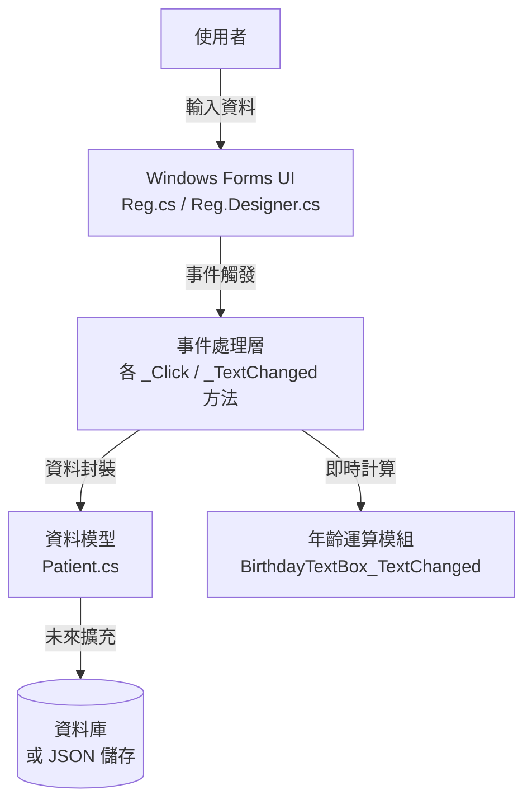

# 憨吉聯合大醫院掛號系統 — 完整說明文件

> **系統名稱**: 憨吉聯合大醫院掛號系統
> **技術平台**: .NET 7 · Windows Forms · C#
> **文件版本**: v1.0.0  ·  2026-03-24

---

## 一、掛號程式畫面說明

### 1.1 系統主畫面


### 1.2 畫面區域說明

主畫面依功能劃分為 **四大區塊**：

```
┌─────────────────────────────────────────────────────┐
│  ▌HEADER 標題列 (panel1)                            │
│        憨吉聯合大醫院                                │
├─────────────────────────────────────────────────────┤
│  ▌SECTION A 病患基本資料 (panel2)                   │
│   [ 病歷號碼 ][ 輸入 ]  [ 姓  名 ][ 輸入 ]         │
│                          [ 性  別 ][下拉] [初診/複診]│
│   [ 生日    ][ 輸入 ] [ 年齡 ] 歲   [ 電  話 ][輸入]│
│   [ 地址    ][ 縣市下拉 ][縣/市][ 區下拉 ][市/區]   │
│                                     [ 詳細地址輸入  ]│
├─────────────────────────────────────────────────────┤
│  ▌SECTION B 掛號資訊 (panel3)                       │
│   [ 掛號日期 ][ 輸入 ]  [ 科別 ][下拉]  [ 醫師][下拉]│
│   ┌───────────────────────────────────────────┐    │
│   │  [ 掛號的號碼 ]     [ 12 ]  (紅字大字型)  │    │
│   └───────────────────────────────────────────┘    │
├─────────────────────────────────────────────────────┤
│  ▌FOOTER 操作按鈕列 (panel4)                        │
│  [掛號確認]  [列印掛號單]  [清空螢幕]  [結束/離開]  │
└─────────────────────────────────────────────────────┘
```

### 1.3 欄位對照表

| 區域 | 欄位名稱 | 控制項類型 | 說明 |
|------|---------|-----------|------|
| A | 病歷號碼 | TextBox | 病患唯一識別碼 |
| A | 姓名 | TextBox | 病患中文姓名 |
| A | 性別 | ComboBox | 0.女 / 1.男 / 2.中性 / 3.未知 |
| A | 初診/複診 | Label (按鈕樣式) | 識別就診類型 |
| A | 生日 | TextBox | 民國年格式 (如 1001120) |
| A | 年齡 | TextBox (唯讀) | 系統自動計算（橘色底）|
| A | 電話 | TextBox | 聯絡電話 |
| A | 地址縣市 | ComboBox | 台北市/新北市/花蓮縣/宜蘭縣 |
| A | 地址鄉鎮 | ComboBox | 對應縣市的鄉鎮市區 |
| A | 詳細地址 | TextBox | 路名、街號 |
| B | 掛號日期 | TextBox | 掛號當日日期 |
| B | 科別 | ComboBox | 1.內科~7.婦產科 |
| B | 醫師 | ComboBox | 各科醫師代號姓名 |
| B | 掛號號碼 | TextBox (紅字) | 系統產生的當日號碼 |

### 1.4 配色設計說明

| 色彩 | 用途 | RGB 值 |
|------|------|--------|
| 深藍 (`#005A9C`) | 標題欄、標籤列、按鈕列 | [(0, 90, 156)](file:///c:/Users/lan/Desktop/Register/Register/Reg.cs#5-11) |
| 淺藍 (`#E6F7FF`) | 資料區面板背景 | [(230, 247, 255)](file:///c:/Users/lan/Desktop/Register/Register/Reg.cs#5-11) |
| 灰白 (`#F0F2F5`) | 視窗整體背景 | [(240, 242, 245)](file:///c:/Users/lan/Desktop/Register/Register/Reg.cs#5-11) |
| 橘色 (`#FFC080`) | 自動計算的年齡欄位 | [(255, 192, 128)](file:///c:/Users/lan/Desktop/Register/Register/Reg.cs#5-11) |
| 紅色  | 掛號號碼（醒目顯示）| `Color.Red` |

---

## 二、資料結構

### 2.1 病患資料模型 (Patient.cs)

```csharp
public class Patient
{
    // ── 身份識別 ──────────────────────────────────────
    public string IdNumber      { get; set; } = string.Empty; // 病歷號碼
    public string Name          { get; set; } = string.Empty; // 姓名
    public string Gender        { get; set; } = string.Empty; // 性別 (0.女/1.男…)

    // ── 基本資料 ──────────────────────────────────────
    public string BirthDate     { get; set; } = string.Empty; // 生日 (民國年)
    public int    Age           { get; set; }                 // 年齡 (自動計算)
    public string Phone         { get; set; } = string.Empty; // 電話
    public string Address       { get; set; } = string.Empty; // 完整地址

    // ── 掛號資訊 ──────────────────────────────────────
    public string RegistrationDate { get; set; } = string.Empty; // 掛號日期
    public string Department       { get; set; } = string.Empty; // 科別
    public string Doctor           { get; set; } = string.Empty; // 醫師
}
```

### 2.2 UI 控制項結構表

```
Reg (Form)
├── panel1 (標題列)
│   └── label1              ← 醫院名稱
│
├── panel2 (病患資料區)
│   ├── label2 / idNumberTextBox    ← 病歷號碼
│   ├── label3 / nameTextBox        ← 姓名
│   ├── label5 / genderComboBox     ← 性別
│   ├── label15                     ← 初診/複診
│   ├── label4 / birthdayTextBox    ← 生日
│   ├── label6 / ageTextBox         ← 年齡 (唯讀)
│   ├── label8 / phoneTextBox       ← 電話
│   ├── label7 / addressTextBox     ← 詳細地址
│   ├── label9 / cityComboBox       ← 縣市
│   └── label10 / districtComboBox  ← 鄉鎮市區
│
├── panel3 (掛號資訊區)
│   ├── label11 / regDateTextBox    ← 掛號日期
│   ├── label12 / departmentComboBox← 科別
│   ├── label13 / doctorComboBox    ← 醫師
│   └── groupBox1 (掛號號碼區)
│       ├── label14                 ← 標籤「掛號的號碼」
│       └── regNumberTextBox        ← 號碼顯示 (紅字大字型)
│
└── panel4 (按鈕列)
    ├── confirmButton   ← 掛號確認
    ├── printButton     ← 列印掛號單
    ├── clearButton     ← 清空螢幕
    └── exitButton      ← 結束/離開
```

### 2.3 下拉選單靜態資料

```
genderComboBox    → ["0.女", "1.男", "2.中性", "3.未知"]
cityComboBox      → ["台北市", "新北市", "花蓮縣", "宜蘭縣"]
departmentComboBox→ ["1.內科", "2.外科", "3.皮膚科", "4.眼科",
                     "5.牙科", "6.小兒科", "7.婦產科"]
doctorComboBox    → ["101.趙一", "102.錢二", "103.孫三",
                     "201.李四", "202.周五", "203.吳六",
                     "301.鄭七", "302.王八", "303.馮九",
                     "401.陳十"]
```

---

## 三、系統設計文件

### 3.1 系統架構



### 3.2 類別職責說明

| 類別 / 檔案 | 職責 |
|------------|------|
| [Reg.cs](file:///c:/Users/lan/Desktop/Register/Register/Reg.cs) | UI 事件處理邏輯、商業規則 |
| [Reg.Designer.cs](file:///c:/Users/lan/Desktop/Register/Register/Reg.Designer.cs) | Visual Studio 自動產生的 UI 初始化程式碼 |
| [Patient.cs](file:///c:/Users/lan/Desktop/Register/Register/Patient.cs) | 病患資料的 POCO 模型，作為資料傳輸物件 (DTO) |
| [Program.cs](file:///c:/Users/lan/Desktop/Register/Register/Program.cs) | 應用程式進入點，啟動主表單 |

### 3.3 核心功能實作

#### 3.3.1 年齡自動計算

```
輸入民國年日期 (如 1001120)
    ↓
解析年份部分 → "100" (民國年)
    ↓
轉換西元年 = 100 + 1911 = 2011
    ↓
計算年齡 = 目前年份 (2026) - 2011 = 15 歲
    ↓
更新 ageTextBox.Text = "15"
```

#### 3.3.2 掛號確認流程

```
使用者點擊 [掛號確認]
    ↓
讀取 nameTextBox.Text
    ↓
彈出訊息框「{姓名} 同學，掛號成功！」
    ↓  (未來擴充)
封裝 Patient 物件 → 儲存至資料庫
```

#### 3.3.3 清空螢幕流程

```
點擊 [清空螢幕]
    ↓
清空所有 TextBox (.Clear())
    ↓
重設 ComboBox 為預設值
    ↓
焦點移回 idNumberTextBox
```

### 3.4 視窗規格

| 項目 | 規格 |
|------|------|
| 技術框架 | .NET 7 Windows Forms |
| 視窗尺寸 | 1200 × 850 px (ClientSize) |
| 字體 | 微軟正黑體 (Microsoft JhengHei) |
| 啟動位置 | 螢幕正中央 (CenterScreen) |
| 主要字體大小 | 標籤 13.8pt · 標題 22.2pt · 號碼 25.8pt |

---

## 四、操作文件

### 4.1 系統啟動

1. 開啟執行檔或在 Visual Studio 中按 **F5** 執行偵錯。
2. 系統自動在螢幕正中央開啟「**憨吉聯合大醫院 — 掛號系統**」視窗。
3. 預設值：性別 = 女，縣市 = 花蓮縣。

---

### 4.2 標準掛號操作流程

```
① 輸入病歷號碼
        ↓
② 輸入姓名
        ↓
③ 選擇性別 / 初診或複診
        ↓
④ 輸入生日 (民國年格式，如 1001120)
   → 系統自動計算並填入年齡
        ↓
⑤ 輸入電話
        ↓
⑥ 選擇縣市 → 選擇鄉鎮區 → 輸入詳細地址
        ↓
⑦ 輸入掛號日期
        ↓
⑧ 選擇科別
        ↓
⑨ 選擇醫師
        ↓
⑩ 確認掛號號碼（紅色大字）
        ↓
⑪ 點擊 [掛號確認] 完成掛號
```

---

### 4.3 各按鈕功能說明

| 按鈕 | 功能 | 快捷提示 |
|------|------|---------|
| **掛號確認** | 顯示掛號成功訊息（未來可連接資料庫儲存）| 確認所有欄位填寫正確後按下 |
| **列印掛號單** | 列印當前掛號資料（目前顯示提示訊息）| 掛號確認後操作 |
| **清空螢幕** | 清除所有欄位並重設下拉選單 | 需要輸入下一位病患時使用 |
| **結束/離開** | 關閉整個掛號程式 | 工作結束時使用 |

---

### 4.4 生日輸入格式說明

> [!IMPORTANT]
> 生日請使用「**民國年格式**」，格式為 `YYYMMDD`（7 位數）  
> 例如：民國 100 年 11 月 20 日 → 輸入 **1001120**

| 輸入值 | 計算結果 | 說明 |
|--------|---------|------|
| `1001120` | 年齡 15 歲 | 民國 100 年生 = 西元 2011 年 |
| `0891001` | 年齡 37 歲 | 民國 89 年生 = 西元 2000 年 |
| `0500315` | 年齡 75 歲 | 民國 50 年生 = 西元 1961 年 |

---

### 4.5 科別與醫師對照

| 科別代碼 | 科別名稱 | 醫師代號 | 醫師姓名 |
|---------|---------|---------|---------|
| 1 | 內科 | 101、102、103 | 趙一、錢二、孫三 |
| 2 | 外科 | 201、202、203 | 李四、周五、吳六 |
| 3 | 皮膚科 | 301、302、303 | 鄭七、王八、馮九 |
| 4 | 眼科 | 401 | 陳十 |
| 5 | 牙科 | — | — |
| 6 | 小兒科 | — | — |
| 7 | 婦產科 | — | — |

---

### 4.6 常見問題

| 問題 | 原因 | 解決方式 |
|------|------|---------|
| 年齡欄位沒有自動填入 | 生日輸入位數不足（需 ≥ 3 位）| 確認輸入至少前 3 位年份 |
| 清空後焦點不回到病歷號 | 正常行為，系統自動聚焦 | 確認視窗在前景 |
| 列印無法使用 | 功能尚在開發中 | 等待後續版本更新 |

---

*文件產生日期：2026-03-24*
